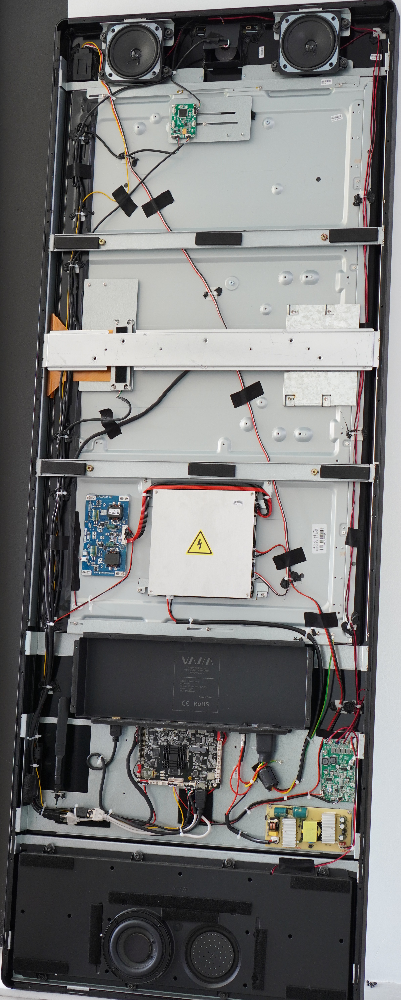
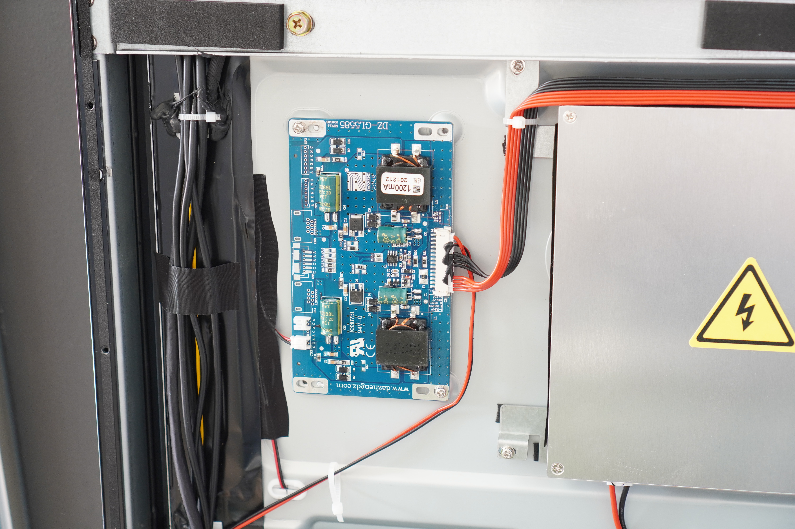
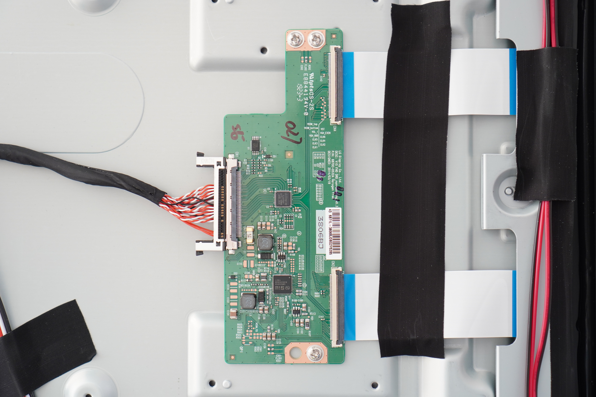

# vaha-m5-hack

Welcome to my repository where I document the reverse-engineering that I have done of the VAHA M5 mirror. Throught this page, you will find my teardown of the device, and the guide to transform it into a giant Android tablet.

## Photos

### Back-side of the device open

### Bottom view

### Backlight driver

### Power Supply Unit

### LCD Panel Controller Board

### Single Board Computer - Front side

### Single Board Computer - Back side

